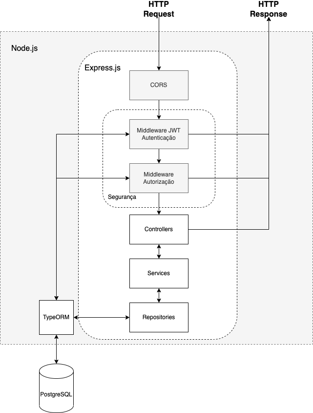
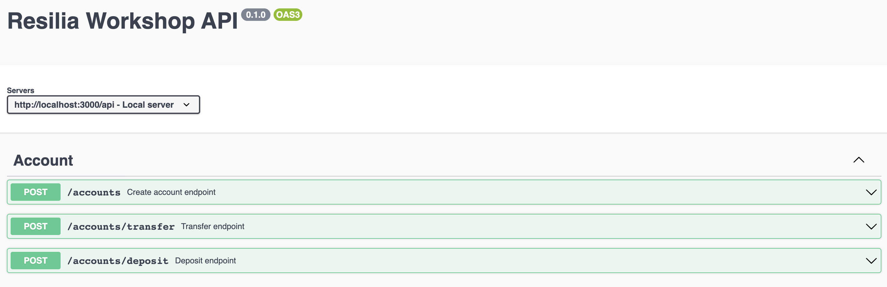
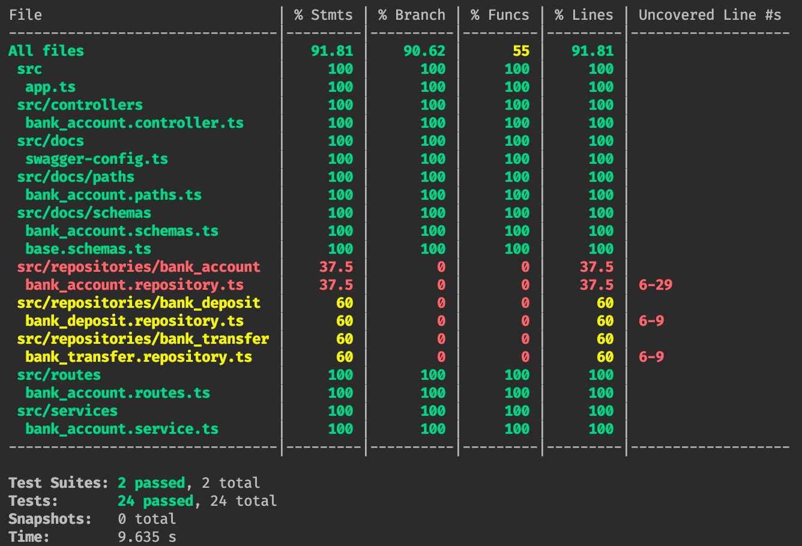
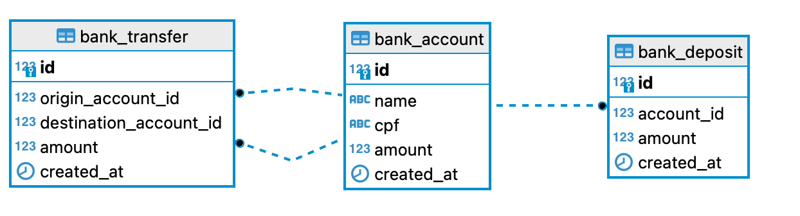

# Workshop Resilia

## Objetivo
Construir uma aplicação web com algumas funções essenciais relacionadas ao gerenciamento de contas bancárias.

## Requisitos

* Possibilitar abertura de uma conta;
  * Os dados necessárioos são: Nome completo e CPF;
  * Só é permitido uma conta por pessoa;
* Com essa conta deve ser possível realizar transações;
  * Transferências para outras contas;
  * Depósito em conta existente;
* As contas não podem ter valor negativo;
* Por questão de segurança, cada transação de depósito não pode ser maior do que R$5.000;

## O que será Avaliado

* Aplicação funcional, ou seja, cumprindo os requisitos;
* Utilização de boas práticas (princípios SOLID, code-smells, etc)
* Estrutura e organização (componentização, uso de camadas, etc)
* Legibilidade do código (nomenclatura de classes, métodos e variáveis, lint, etc)
* Implementação de testes que garantam que o código está atendendo os requisitos
* Documentação (histórico de commits no git, readme, diagramas, etc)

## Solução

### Requisitos

1. Node@>=16
2. Npm@>6
3. Docker
4. Docker Compose

Rode o comando `docker compose up -d` para rodar a API e o banco de dados.

### Arquitetura

**Controller**: Responsável por validar a requisição, repassar para o serviço de domínio correto e entregar a resposta ao cliente.

**Service**: Responsável por aplicar as regras de negócio.

**Repository**: Responsável pela persistência de dados

### Documentação da API

Acesse http://localhost:3000/docs

### Testes

Rode o comando `npm run test:coverage`

### Modelagem do banco de dados

### Passo a passo para implementação

[Clique aqui](passo-a-passo.md)